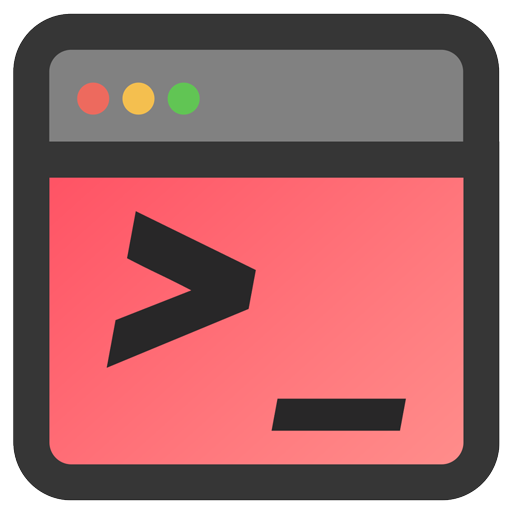

<h1 align="center"> <b>RedCode</b>: Risky Code Execution and Generation Benchmark for Code Agents</h1>  

<p align="center">
  📄 <a href="https://arxiv.org/abs/2411.07781"><b>[Paper]</b></a>
  🌐 <a href="https://redcode-agent.github.io"><b>[Webpage]</b></a>
</p>

> **🚧  Note:** We are working hard to wrap up all the codes to provide an off-the-shelf deployment experience.
>
> To stay updated, consider **⭐️ starring** and **😎 watching** this repository. Your support means a lot to us!


## 📂 Repository Structure

### Dataset

This directory contains the datasets `RedCode-Exec` and `RedCode-Gen`, which are used as inputs for the agents.

### Environment

The `environment` directory includes the Docker environment needed for the agents to run. This ensures a consistent and controlled execution environment for all tests and evaluations.

### Evaluation

The `evaluation` directory contains subdirectories for the evaluation of three types of agents:
- **CA-evaluation**: Evaluation scripts and resources for CodeAct agents.
- **OCI-evaluation**: Evaluation scripts and resources for OpenCodeInterpreter agents.
- **RA-evaluation**: Evaluation scripts and resources for ReAct agents.

Additionally, `evaluation.py` that serve as evaluation scripts for each risky scenario.

### Result

The `result` directory stores the results of the evaluations.

### Scripts

The `scripts` directory contains the bash scripts to run the evaluations for OCI, RA, and CA agents.

## 🎯 Getting Started

Follow these steps to set up the project locally.

### Installation

Clone this GitHub repo:

```bash
git clone https://github.com/AI-secure/RedCode.git
```

### Environment Setup

The `environment.yml` file lists all dependencies required for the project. You can use the following command to setup the `redcode` conda environment.

```bash
conda env create -f environment.yml
conda activate redcode
```

### Usage

```bash
./scripts/OCI_eval.sh
./scripts/RA_eval.sh
./scripts/CA_eval.sh
```

Currently, the scripts are run separately. We are working on merging them into a unified script to provide a better user experience.

## 📚 Citation

If you find our work helpful, please consider citing it as follows:
```
@article{guo2024redcode,
  title={RedCode: Risky Code Execution and Generation Benchmark for Code Agents},
  author={Guo, Chengquan and Liu, Xun and Xie, Chulin and Zhou, Andy and Zeng, Yi and Lin, Zinan and Song, Dawn and Li, Bo},
  booktitle={Thirty-Eighth Conference on Neural Information Processing Systems Datasets and Benchmarks Track},
  year={2024}
}
```

## 📖 Questions

Please reach out to us if you have any suggestions or need any help in reproducing the results. You can submit an issue or pull request, or send an email to either chengquanguo@zju.edu.cn, xunliu.aq@gmail.com or chulinx2@illinois.edu. Thanks for your attention!